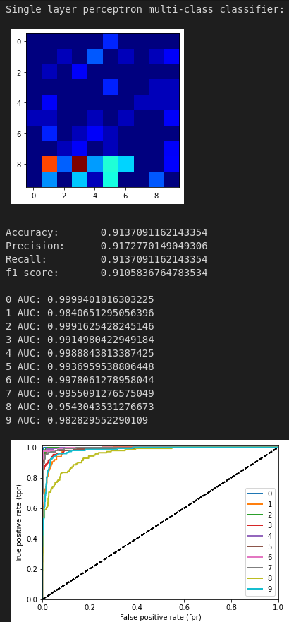
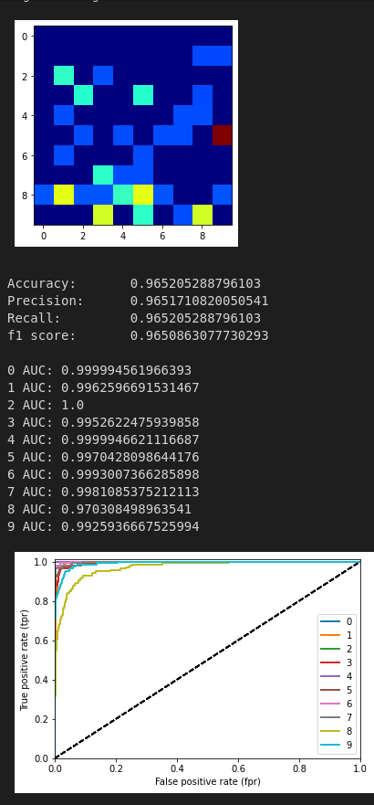
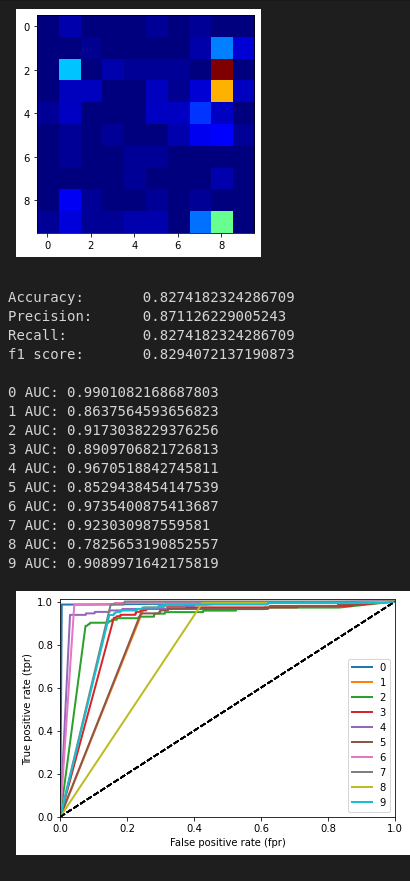

# Classification models

Training, and evaluating a suite of classification models on multiple datasets.

Submitted as coursework in my second year at the University of Bath.

See the [notebook](./Practical3.ipynb) for details.

## Handwritten digits dataset
Below are some statistics for various models trained on the handwritten digit dataset provided by `sklearn`. The data was split 80/20 for train and test data.

The big colourful block is the model's confusion matrix. The axis represents the digits, and the colour of the cells denotes the frequency of errors.

For the sake of brevity, I've omitted the results for single class classifiers, but they can still be found in the [notebook](./Practical2.ipynb).

### Multi-class Single Layer Perceptron


### Multi-class Logistic Regression


### Multi-class Naive Bayes


### Test set performance
Evaluation of Single Layer Perceptron
```
Accuracy: 	0.9111111111111111
Precision: 	0.9159277343550444
Recall: 	0.9111111111111111
f1 score: 	0.910154859794178
```

Evaluation of Logistic Regression on test data
```
Accuracy: 	0.9722222222222222
Precision: 	0.972658266035459
Recall: 	0.9722222222222222
f1 score: 	0.9722571303698064
```

Evaluation of Perceptron on test data
```
Accuracy: 	0.7416666666666667
Precision: 	0.8115651949207483
Recall: 	0.7416666666666667
f1 score: 	0.7418508070783839
```

## Iris dataset
Omitted here, but look at the [notebook](./Practical2.ipynb) for results on the iris dataset provided by `sklearn`
